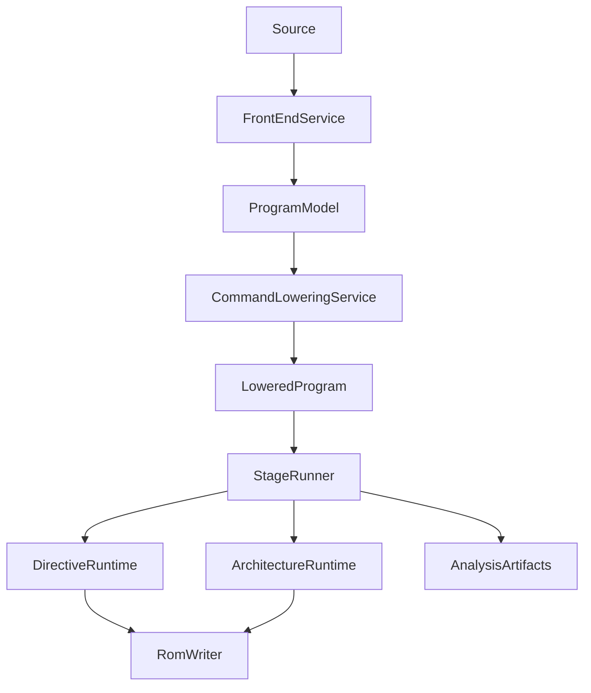

# Assembler Long-Term Goals

This document is the long-term tracking plan for making the assembler easier to
understand, safer to change, better covered by tests, and ready for future
multi-architecture and language-server work.

It supersedes `ASSEMBLER_REFACTOR_OPTIONS.md` and
`ASSEMBLER_REFACTOR_STATUS.md` for planning. Those older documents remain useful
as historical context for the service extraction, directive registry, and
single-execution-path goals.

## Vision

The assembler core should become a small, explicit execution pipeline:

1. Parse source text into a durable program model.
2. Lower the program model into typed execution units.
3. Execute one production path through directive handlers and architecture
   encoders.
4. Emit ROM bytes, diagnostics, source mappings, symbols, references, and
   analysis artifacts from the same source of truth.

The immediate goal is not to preserve the current TypeScript API. The current
surface is internal and can be reshaped aggressively when doing so removes
legacy bridges, clarifies responsibilities, or makes future tooling easier.

Long term, the assembler should support:

- understandable ownership boundaries instead of one large session object;
- high test coverage across services, directives, architectures, and analysis;
- additional similar architectures without rewriting the core pipeline;
- analysis-only execution suitable for language servers and IDE integrations;
- deterministic diagnostics, symbol lookup, references, and include graphs.

## Non-Negotiables

- There is one production execution path. Legacy/tree drivers can remain only as
  parity or compatibility oracles while the transition is active.
- `AssemblySession` must shrink into explicit internal capabilities. Directive
  handlers should only receive the state and services they actually need.
- Bridge removal is test-first. Add focused tests before changing behavior that
  currently depends on passthrough commands or duplicated executors.
- Compatibility behavior is isolated behind internal policy/profile boundaries,
  not scattered through core execution.
- Fixture parity and known real-world assembly checks stay green throughout the
  refactor.
- No public plugin or extension API is frozen until the internal architecture
  and directive contracts are small and stable.

## Current State

The earlier refactor completed the most important foundation work:

- `src/directives/registry.ts` and grouped `src/directives/*.ts` handlers exist.
- `src/services/assembly-front-end-service.ts` owns buffering and normalization.
- `src/services/program-model-builder.ts` builds executable program models.
- `src/services/command-lowering-service.ts` lowers commands into execution
  units.
- `src/services/macro-engine.ts`, `define-engine.ts`, `struct-engine.ts`,
  `symbol-scope-service.ts`, and `rom-writer-service.ts` own major subsystems.
- `src/file-provider.ts` separates file and in-memory source loading.
- Integration, IR, and service-seam tests provide broad fixture and parity
  coverage.

The transition is still incomplete:

- Lowered execution exists, but `LoweredPassthroughCommand` still routes many
  commands through normalized command dispatch.
- Tree execution and lowered execution still have parallel loop and conditional
  paths.
- `src/assembler.ts` still owns mutable state, stage snapshots, stage execution,
  expression/define glue, include flow, directive effects, diagnostics, tracing,
  and ROM coordination.
- `src/directives/types.ts` has useful capability slices, but `AssemblySession`
  still extends all of them.
- Some directive modules are mostly routers into methods or services still owned
  by `Assembler`.
- Compatibility-specific rules are partly centralized, but still visible in
  execution and handler logic.

## Target Pipeline

`Assembler` should eventually be a facade over this pipeline, not the object
that owns every subsystem and every mutable field.

## Roadmap

### 1. Establish The Baseline

Start each behavior-changing slice by proving the current behavior.

Required gates:

- `npm test`
- `npm run test:coverage`
- fixture parity in `tests/assembler.integration.test.ts`
- IR coverage in `tests/ir.test.ts`
- service seam coverage in `tests/service-seams.test.ts`
- large real-world compile checks such as the current `chou` flow when the
  changed area could affect includes, layout, encoding, or ROM output

Focused coverage to add before major edits:

- `CommandLoweringService` shapes for directives, passthrough commands,
  instructions, loops, and conditionals;
- `DirectiveRegistry.dispatchCommand()` and direct registry construction;
- each directive module's visible behavior, especially memory, namespace,
  layout, table, SPC, include/incbin, relative labels, fill/pad, and data;
- stage state creation, apply/capture behavior, and lowered-program caching;
- analysis recovery, diagnostics, symbols, references, and source spans.

Exit criteria:

- Baseline commands are documented and repeatable.
- New tests describe current bridge behavior before bridge removal begins.
- Coverage reports are available, even if strict thresholds are not enabled yet.

### 2. Finish Canonical Lowered Dispatch

Make `LoweredProgram` the durable representation used by production assembly.
Reduce passthrough commands only when the parsed metadata already carries the
semantics needed by the handler.

Priority order:

1. Add explicit lowering tests for every directly lowerable directive family.
2. Add dispatch tests proving direct lowered nodes do not call
   `processNormalizedCommand()`.
3. Expand direct lowering for low-risk directive families.
4. Keep define, label, macro placeholder, function, and preprocessing-sensitive
   forms as passthrough until their semantics are represented in the front-end
   model.
5. Delete passthrough categories only after parity tests prove the lowered path.

Exit criteria:

- `runStage()` executes a lowered program for normal production assembly.
- Stable directives and instructions dispatch without normalized redispatch.
- Passthrough commands are rare, named, and justified by tests.
- Cached program nodes are not reparsed from raw source during steady-state
  execution.

### 3. Collapse Duplicate Executors

The lowered executor is the target. Tree execution should either lower before
execution or exist only in tests while parity is being retired.

Priority order:

1. Route completed runtime nodes through lowering before execution where safe.
2. Share loop and conditional execution through lowered node execution.
3. Remove tree-specific loop and conditional behavior after parity proves
   equivalence.
4. Keep any remaining legacy driver as a test oracle, not a production path.

Exit criteria:

- There is one production executor for commands, loops, and conditionals.
- Loop and conditional fixes require changes in one place.
- Legacy/tree execution paths are removed or explicitly test-only.

### 4. Shrink Session Surface Area

The current capability interfaces are a useful start, but `AssemblySession`
still exposes the combined assembler. Replace it with focused contexts that
match real dependencies.

Suggested internal capabilities:

- state: current file, line, stage, and execution mode;
- cursor/layout: target address, base address, mapper, bank checks, and stacks;
- emission: write methods, fill/pad state, ROM writer, and finalization state;
- symbols: labels, relative labels, namespaces, definitions, and references;
- expressions: define resolution, math evaluation, operand resolution;
- includes: file provider, include stack, includeonce state, and include graph;
- compatibility: ASAR behavior flags and profile decisions;
- diagnostics: recoverable errors, source spans, and analysis artifacts.

Priority order:

1. Keep existing capability slices but stop passing the combined session into
   new code.
2. Give each directive family the smallest context it needs.
3. Move shared state behind owned state objects or focused services.
4. Remove direct handler access to unrelated `Assembler` fields.

Exit criteria:

- Directive handlers no longer receive broad `AssemblySession` access.
- Adding or extracting a directive reveals its dependencies in its type.
- `Assembler` no longer needs to implement every directive capability.

### 5. Extract Remaining Directive Effects

Directive modules should own directive behavior or delegate to focused runtime
services. `Assembler` should not be the long-term home for directive bodies.

Priority families:

- data directives: `db`, `dw`, `dl`, `dd`, and `dc.*`;
- layout directives: `org`, mapper toggles, `base`, `pushbase`, `pullbase`,
  `startpos`, `pushpc`, and `pullpc`;
- include/source directives: `incsrc`, `include`, `includeonce`, and `incbin`;
- memory directives: `freecode`, `freedata`, `freespace`, `freespacebyte`,
  and `prot`;
- namespace directives: `namespace`, `pushns`, and `pullns`;
- table directives: `pushtable` and `pulltable`;
- SPC directives: `spcblock` and `endspcblock`;
- flow-control labels: `+` and `-`.

Priority order:

1. Add direct tests for one directive family.
2. Narrow that family's capability context.
3. Move behavior into the module or a focused runtime service.
4. Keep one integration/parity check proving fixture behavior did not move.

Exit criteria:

- Directive behavior lives beside directive registration or in named runtime
  services.
- `Assembler` no longer exposes trampoline-style directive methods.
- Directive modules are independently testable without constructing the full
  assembler whenever practical.

### 6. Separate Architecture Concerns

The core pipeline should not know SNES-specific instruction details. It should
ask the active architecture to classify, size, encode, and diagnose.

Architecture contracts should cover:

- instruction parsing and lowering;
- operand classification;
- layout sizing;
- emission encoding;
- architecture-specific diagnostics;
- address and mapper constraints where applicable.

Priority order:

1. Make the existing 65816, SPC700, and SuperFX paths conform to one internal
   architecture contract.
2. Test each architecture independently from assembler orchestration.
3. Move architecture-specific operand and encoding decisions out of generic
   execution code.
4. Consider a public extension API only after the internal contract survives at
   least one additional architecture-like target.

Exit criteria:

- Adding a similar architecture mostly means registering a definition and tests.
- Architecture code does not depend on broad assembler mutable state.
- Core execution can route architecture work without knowing instruction
  internals.

### 7. Prepare For Language Server Support

Language-server support should use the same parse/model/lower/analyze pipeline,
but it must not require ROM emission for every editor operation.

Required artifacts:

- source spans for commands, operands, labels, directives, and diagnostics;
- symbol definitions and references;
- include graph and file dependency information;
- diagnostics with stable ranges and severity;
- analysis mode that recovers from local errors;
- incremental parsing or targeted re-analysis hooks;
- optional emission mode for commands that need layout confirmation.

Priority order:

1. Preserve spans and symbol/reference data through lowering.
2. Make analysis-only entrypoints first-class and side-effect-limited.
3. Keep diagnostics deterministic under partial or invalid source.
4. Expose internal data structures that can back hover, go-to-definition,
   references, document symbols, semantic tokens, and code actions.

Exit criteria:

- The assembler can analyze source and return useful diagnostics/symbols without
  requiring final ROM output.
- Source artifacts are stable enough to power editor features.
- Recovery behavior is tested with invalid and incomplete source.

### 8. Ratchet Coverage And Cleanup

Coverage should become stricter as the large assembler surface shrinks. Do not
set brittle per-file thresholds while `assembler.ts` still owns unrelated
responsibilities.

Priority order:

1. Track coverage reports for every refactor slice.
2. Add focused unit tests around extracted services and directive modules.
3. Introduce per-file thresholds for stable small modules first.
4. Raise thresholds around architecture encoders and directive modules before
   enforcing them on the remaining facade.
5. Remove obsolete bridge tests and historical docs once their replacements are
   complete.

Exit criteria:

- New services and directive modules have meaningful focused coverage.
- Coverage regressions are visible before they become blockers.
- Historical compatibility bridges are deleted once no longer needed.

## Progress Checklist

- [ ] Baseline test and coverage gates documented and repeatable.
- [ ] Focused lowering tests cover current direct and passthrough behavior.
- [ ] Lowered dispatch is the normal path for stable directives and
      instructions.
- [ ] Passthrough commands are minimized and justified.
- [ ] Tree and lowered executors are consolidated.
- [ ] Directive handlers use focused capabilities instead of a broad session.
- [ ] Remaining directive effects are extracted from `Assembler`.
- [ ] Architecture definitions own instruction-specific behavior.
- [ ] Analysis-only entrypoints produce diagnostics, symbols, references, and
      include data.
- [ ] Coverage thresholds are introduced for stable extracted modules.

## Near-Term Slice Order

1. Add focused tests around `CommandLoweringService` and the current passthrough
   boundary.
2. Lower one safe directive family directly, prove dispatch avoids normalized
   passthrough, and keep fixture parity green.
3. Repeat family-by-family until passthrough commands are limited to true
   preprocessing cases.
4. Route runtime tree execution through lowering and remove duplicated loop and
   conditional logic.
5. Replace broad directive session access with family-specific capabilities as
   directive behavior moves out of `Assembler`.

